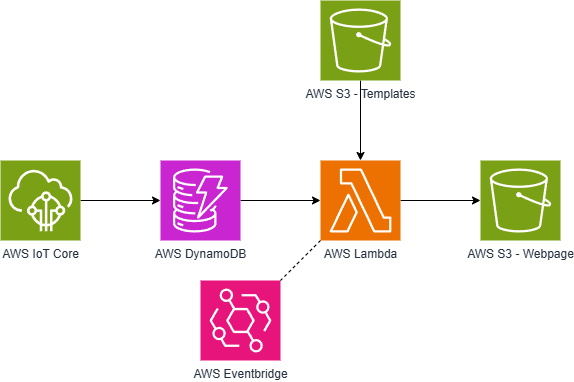

# Eagle Plant Library

## Introduction

It can be very difficult to track the various watering, lighting, or other needs that all my plants require. I figured that there must be a way that technology can play a more robust role in this problem than just setting reminders and doing ad-hoc google searches. I recently watched a video of a husband that QR coded his wife's christmas decorations, these codes told her what was in each box. After watching this video, I realized I could apply a very similar methodology to my plant problem. 

By incorporating a QR code per plant, not only could I provide general information about the various plant species I own, I could also set up sensors in each pot to query and display important information for my plants. The QR codes allow me to scan them and immediately see if the plant needs watering, if its getting enough sun or if the air is humid enough for the plant. All of these pieces of information would be incredibly tedious to get manually for each plant, however by being able to tie QR codes to specific plants, I can automatically collect these data per plant and see the metrics in a visually appealing way. This makes plant care incredibly easy. Since the metrics are pretty robust, using some simple logic, I'm also able to tell when a plant was last watered, and approximately when it should be watered next. 

## User Experience

As with any technology, it's important to prioritize the user experience. Your backend and functionality and be the most robust system ever, but if your UI is slow, nobody cares. In this project, it is incredibly easy for the user to get what they need. They simply walk up to any plant(s), scan the QR code attached to the pot and a webpage loads on their phone with information specific to that plant. To enable this simple experience, I set generated QR codes with a domain URL encoded into them that directs them to an API Gateway resource in AWS. The QR Code also contains URL encoded data that identifies the specific plant that code is associated with. Once they reach the API Gateway, they are forwarded to an AWS Lambda, that takes in the URL encoded data and gives the user a pre-signed URL and automatically redirects the user. Upon redirect, the user is sent to a pre generated static website that hosts the data specific to that plant. The redirect URL goes to a AWS S3 bucket object, which is configured to act as a static website. Which means, when the user is redirected to that file, the file acts as a webpage, allowing them to scroll around and see sensor data in near real time, specific to the plant they are interested in.

## Backend

The cloud-native backend is fairly straight forward. First, an AWS IoT Core broker service has been set up to retrieve the MQTT messages from the sensors installed on the plants. Data from sensors is then forwarded to AWS DynamoDB for storage. Data is sent to the DynamoDB table once every 10 minutes from the sensors (no need for more granular data than that). Approximately every 5 minutes, an AWS Lambda function runs, this Lambda is triggered via a cron job in AWS EventBridge. This Lambda queries data from the DynamoDB database and triggers any necessary additional lambdas that are more analysis specific (ex. determining last water time/date). The Lambda also retrieves templates from the S3 bucket that stores HTML templates for each of the plants. Once all data has been collected and analyzed, the Lambda inserts that data into the defined variables outlined in the HTML templates. Upon completion, AWS Lambda pushes the updated HTML files to the webpage S3 bucket, which is configured to act as a static website. This then updates the webpage that the user can access via the QR code with the latest sensor data. 

## Hardware

## How to Add a New Plant

## How to Use This Project for Your Own Garden

